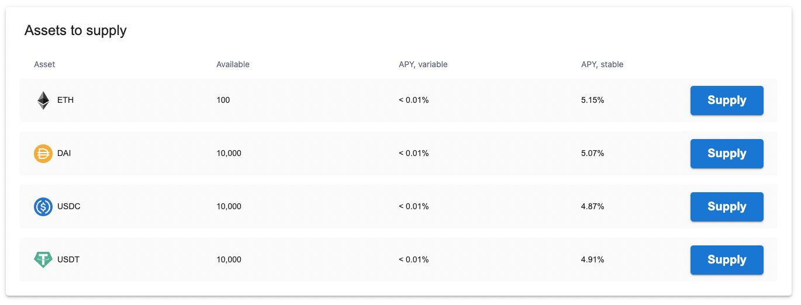
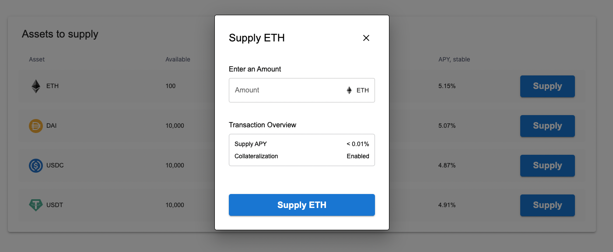

## Getting Started

This is a basic component for crypto assets that you can supply to a lending protocol. Currently it is setup for mock data, but the idea is that it will read the assets from your wallet and you can supply them as collateral to the lending protocol.

## Run dev environment

You can run `npm run dev`

## Screenshot

